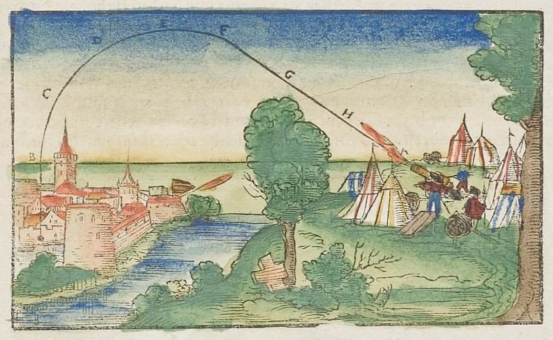
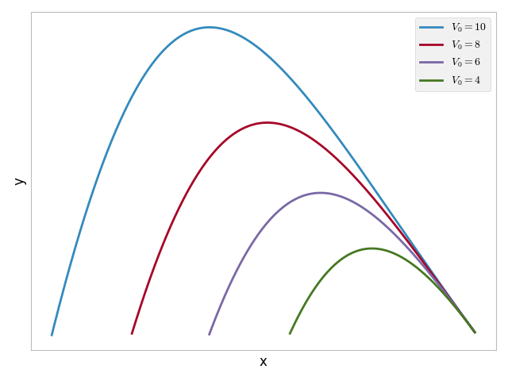

# Introduction to machine learning

Machine learning is often described as having an algorithm "learn" from "data".
More pragmatically it always consists in adjusting the parameters of a parametric model (for example the weights of a linear regression model) to maximize a numerical criterion representing the model's fitness for its task (for example, minimize the model's sum of squared errors for regression), using an optimization algorithm (gradient descent for example).
This is essentially the same definition as fitting a statistical model. The term "machine learning" emerged when the advance of computational powers allowed to move from very simple model for which the parameters maximizing the fitness criterion had an analytical solution, to more complex models which required stepwise optimization methods. Hence the learning part of machine learning, as "training" of the model could take a lot of time while the model was becoming increasingly better at it's task.

## Physics : a first example of parametric model

Physics is the science of describing the laws of our universe with models. In his work "Physics", Aristotle (-384/-322) hypothesises that when the action imposed on an object ceases, the object returns to its natural motion: up for smoke, down for stones. He explains the fact that a stone thrown does not immediatly falls towards the ground after it leaves the hand due to the action of the displaced air. His model was missing key notions such as momentum from Newtownian physics.

Physics models remained mostly qualitative before Newton. For example, the trajectory of a canonball was approximated with simple geometrical shapes, and there existed Nomograms of the trajectory for several initial angles of the canon.

The first quantitative physical model was introduced with differential calculus by Isaac Newton (1643/1727):

$$
m \times \frac{\partial \vec{V}}{\partial t} = m \times \vec{g} + C \times \vec{V}^2
$$

