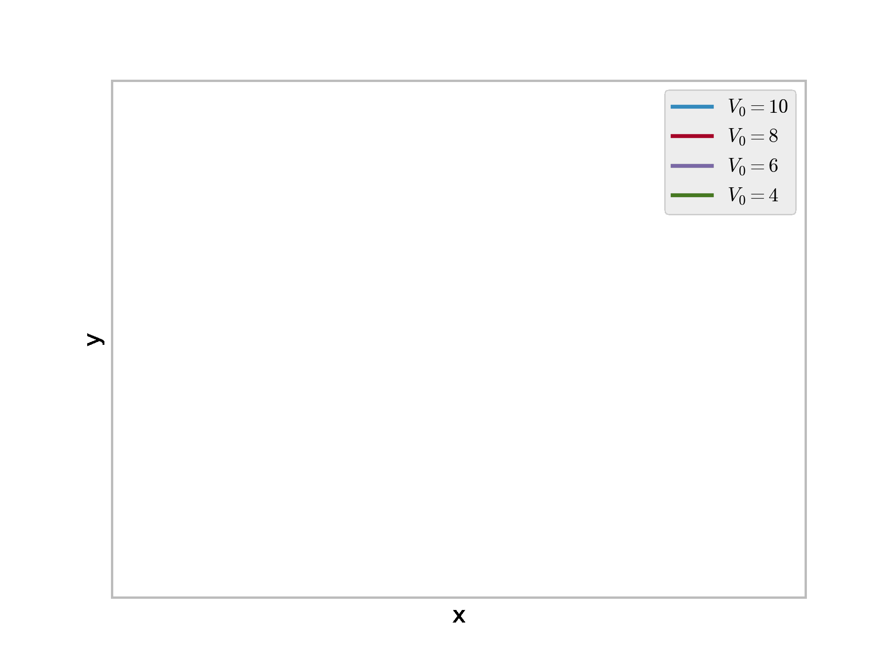
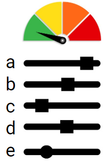
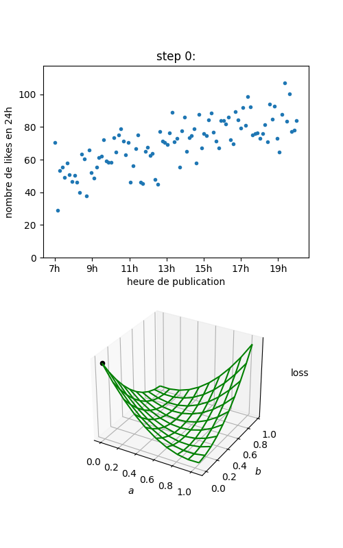

# Introduction to machine learning

Machine learning is often described as having an algorithm "learn" from "data".
More pragmatically it always consists in adjusting the parameters of a parametric model (for example the weights of a linear regression model) to maximize a numerical criterion representing the model's fitness for its task (for example, minimize the model's sum of squared errors for regression), using an optimization algorithm (gradient descent for example).
This is essentially the same definition as fitting a statistical model. The term "machine learning" emerged when the advance of computational powers allowed to move from very simple model for which the parameters maximizing the fitness criterion had an analytical solution, to more complex models which required stepwise optimization methods. Hence the learning part of machine learning, as "training" of the model could take a lot of time while the model was becoming increasingly better at it's task.

## Physics : a first example of parametric model

Physics is the science of describing the laws of our universe with models. Physics models remained mostly qualitative before Newton. For example, the trajectory of a canonball was approximated with simple geometrical shapes, and there existed Nomograms of the trajectory for several initial angles of the canon.

The first quantitative physical model was introduced with differential calculus by Isaac Newton (1643/1727):

$$
m \times \frac{\partial \vec{V}}{\partial t} = m \times \vec{g} + C \times \vec{V}^2
$$

Parametric models are models that have inputs, produce outputs, and have adjustable parameters. This model is a parametric model that take as input the velocity, and gives the acceleration.
The parameters of the model are g the gravity acceleration constant, m the mass of the canonball, C the drag coefficient, and V0 the initial velocity at exit of the muzzle. The parameters of this physical model were determined independently by specially crafted experiments. For example, timing the fall of a marble of neglectible drag gives g. Weighting the canonball gives m. The drag coefficient C for a sphere of same diameter can be measured from the terminal velocity of a sphere made of a lighter material like paper. And finally, measuring the distance traveled by the canonball gives its initial velocity.

## Cost function minimization

Because it is not always possible to make new experiments, or because some parameters cannot be decoupled from each other, another alternative exists to choose the parameters of a parametric model.

In the previous example, lets assume we have the trajectory of a canonball.
For any set of parameters we can compute the trajectory of the canonball thanks to the model. We could plot the trajectory for an initial set of parameters, and adjust the parameters to obtain the best possible fit with the experimentally measured trajectory.

This kind of approach was first publicated by Adrien-Marie Legendre in *Nouvelles méthodes pour la détermination des orbites des comètes* in 1805. He applied this method to find the equation of the conic best describing the trajectory of a comete. For his application, Legendre formalized the "best fit" as the set of parameters which minimizes the sum of square deviations between model and measurement points. This was coined as the least squares method.

Under the heavy influence of numerical optimization in economics modeling, this function that we want to minimize is called the loss function or sometimes cost function.

Ideally this loss function has a single minimum, and an analytical derivative with regards to each of the parameters, for which we can solve for the zero. In these cases we can obtain an analytical solution of the parameters that minimize the loss. Notably, this is the case for linear model least squares regressions. However in most practical cases this is not true.

## Numerical optimization

Optimization algorithms aim at finding efficiently a minimum (often a local one) in as few steps and function evaluation as possible.

### Gradient descent algorithm

The most commonly used optimization algorithm is the gradient descent algorithm (Augustin-Louis Cauchy 1847). The loss as a function of other parameters can be seen as an hyper-surface we want to find the minimum of. The idea of the gradient descent is to start from an initial position of random parameters, and follow the slope of the cost function toward a local minimum.

The gradient is the vector of derivatives of the loss function with regards to eahc of the model's parameters. It points in the uphill direction, so we make small displacements in the parameters space, in the direction opposed to the gradient. The value of the gradient is to be updated at each step. Idealy an analytical expression of the gradient should be used, otherwise it can be approximated numerically.

In the next figure we fit a linear function y=a*x+b to some data points. In the upper panel we represent the data points in blue, the fitted curve in purple, and the deviation between observation and prediction in red. The loss to minimize is the sum of the square length of the red segments.

### Genetic algorithm

Another less often used optimization algorithm is the genetic algorithm optimization (John Holland 1960). It is inspired for the theory of evolution. The vector of all the parameters of the model is assimilated to the genetic coe of an individual. The criterion to optimize for is
a fitness score that we want to maximize.
