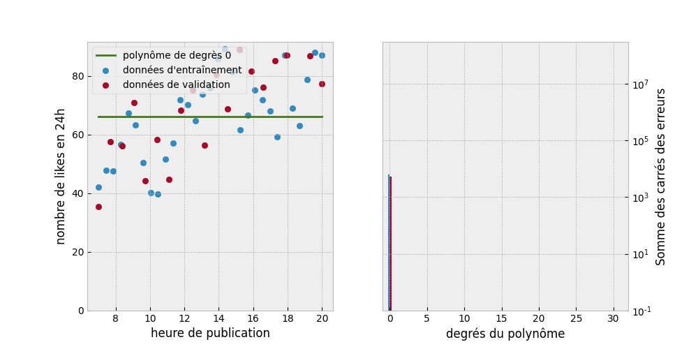
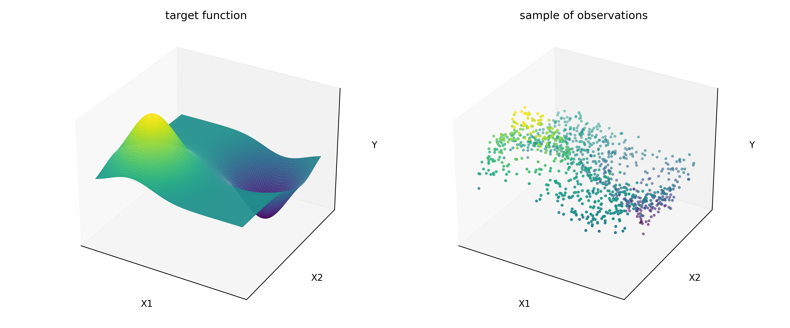
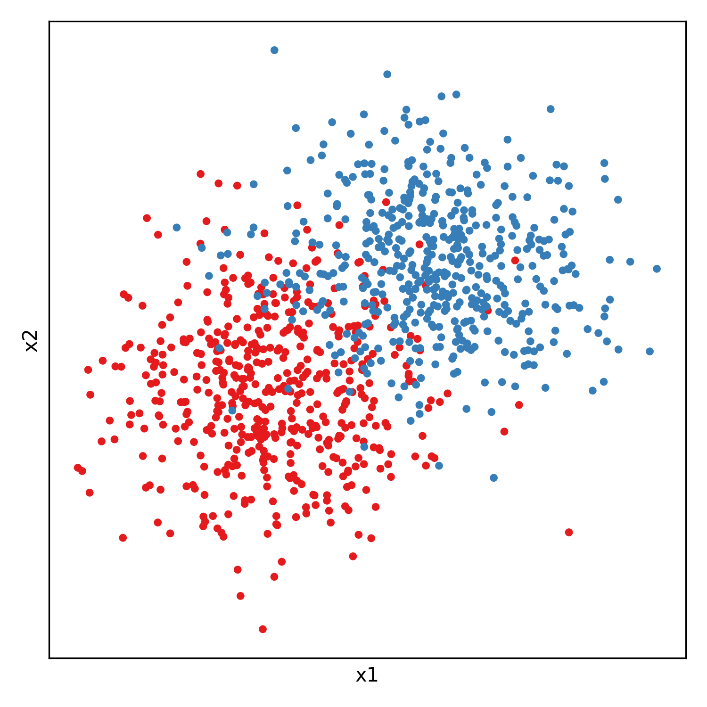
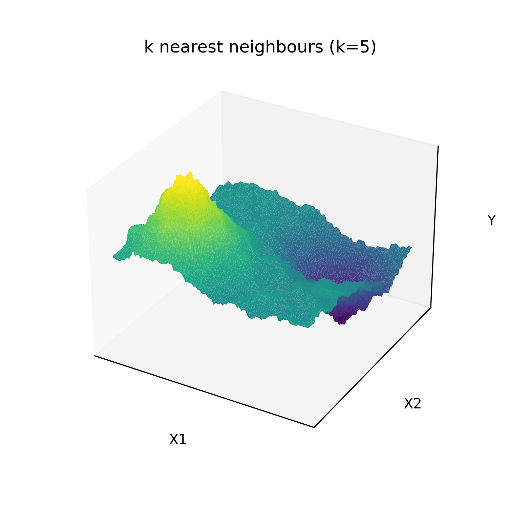
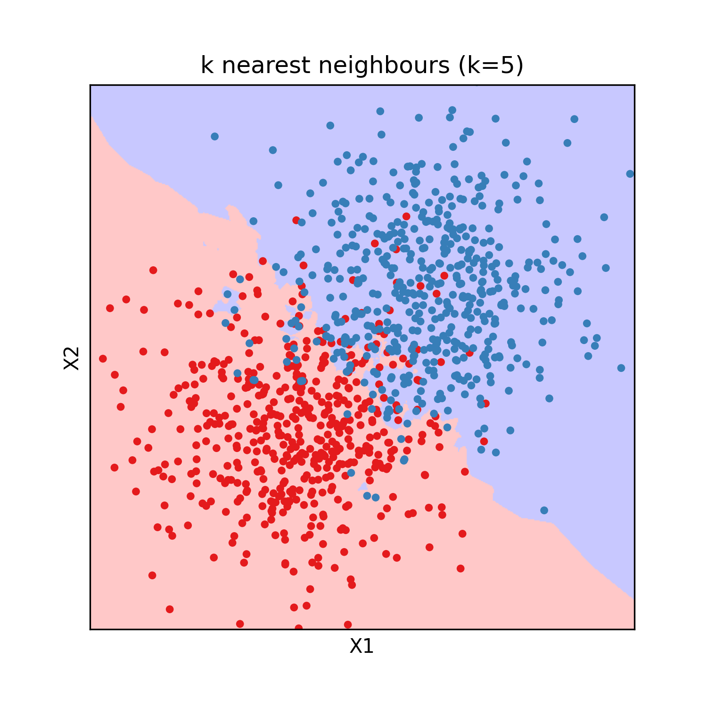

# Introduction to machine learning

Machine learning is often described as having an algorithm "learn" from "data".
More pragmatically it always consists in adjusting the parameters of a parametric model (for example the weights of a linear regression model) to maximize a numerical criterion representing the model's fitness for its task (for example, minimize the model's sum of squared errors for regression), using an optimization algorithm (gradient descent for example).
This is essentially the same definition as fitting a statistical model. The term "machine learning" emerged when the advance of computational powers allowed to move from very simple model for which the parameters maximizing the fitness criterion had an analytical solution, to more complex models which required stepwise optimization methods. Hence the learning part of machine learning, as "training" of the model could take a lot of time while the model was becoming increasingly better at it's task.

## Physics : a first example of parametric model

Physics is the science of describing the laws of our universe. It is the pioneer discipline that introduced the usage of mathematical parametric models: equations that take inputs, produce outputs, and depend on adjustable parameters.

Physics models remained mostly qualitative before Newton. For example, the trajectory of a canonball was approximated with simple geometrical shapes, and there existed Nomograms of the trajectory for several initial angles of the canon.

The first truely quantitative physical model was introduced with differential calculus by Isaac Newton (1643/1727):

$$
m \times \frac{\partial \vec{V}}{\partial t} = m \times \vec{g} + C \times \vec{V}^2
$$

This model is a parametric model that take as input the velocity, and gives the acceleration.
The parameters of the model are g the gravity acceleration constant, m the mass of the canonball, C the drag coefficient, and V0 the initial velocity at exit of the muzzle. The parameters of this physical model were determined independently by specially crafted experiments. For example, timing the fall of a marble of neglectible drag gives g. Weighting the canonball gives m. The drag coefficient C for a sphere of same diameter can be measured from the terminal velocity of a sphere made of a lighter material like paper. And finally, measuring the distance traveled by the canonball gives its initial velocity.

## Best fitting parameters

Measuring the value of each parameter independently with specialy crafted experiment is not always possible. Because sometimes parameters cannot be decoupled from each other, or new experiments cannot be freely done. Another alternative is to adjust all the parameters at once to best fit to the observations.

In the previous example, lets assume we have measurements of the trajectory of a canonball. We could adjust the parameters to obtain the best possible fit of the predicted trajectory with the experimentally measured trajectory.

This kind of approach was first publicated by Adrien-Marie Legendre in *Nouvelles méthodes pour la détermination des orbites des comètes* in 1805. He applied this method to find the equation of the conic best describing the trajectory of a comete. For his application, Legendre formalized the "best fit" as the set of parameters which minimizes the sum of square deviations between model and measurement points. The square in this criterion gives an higher weight to big errors, and takes the absolute value of the errors so that they can't compensate each others. This was coined as the least squares method.

For some specific cases, the sum of squared errors admits a single minimum and no maximum. Consequently the zero of its derivative with regards the parameters gives the best fiting set of parameters: the best fit is given by an analytical solution. This is notably the case for linear models.

## Numerical optimization

Because it is not always possible analyticaly, optimization algorithms aim at finding numericaly the minimum of a function (often only a local minimum) in as few function evaluations as possible.

Under the heavy influence of numerical optimization in economics modeling, this function that we want to minimize is called the loss function or sometimes cost function.

### Gradient descent algorithm

The most commonly used optimization algorithm is the gradient descent algorithm (Augustin-Louis Cauchy 1847). The loss as a function of other parameters can be seen as an hyper-surface we want to find the minimum of. The idea of the gradient descent is to start from an initial position of random parameters, and follow the slope of the cost function toward a local minimum.

The gradient is the vector of derivatives of the loss function with regards to each of the model's parameters. It points in the uphill direction, so we make small displacements in the parameters space, in the direction opposed to the gradient. In practice this displacement is usualy chosen as a factor called learning rate that multiplies minus the gradient. The gradient is function of the parameters and so must be updated at each step. Idealy an analytical expression of the gradient should be used, otherwise it can be approximated numerically.

In this animation we fit a linear function y=a*x+b to some data points. In the left panel we represent the data points in blue, the fitted curve in orange, and the deviation between observation and prediction in red. The loss to minimize is the sum of the squared lengths of the red segments.
On the right panel, we ploted in green the value of the sum of squared error (the loss) as a function of the parameters a and b. The black dots are the position in the parameters space. In this two-parameters case, the gradient descent can be viewed as following the slope of a 3D surface and can be visualized.

The scale of the parameters is important for this algorithm. If the optimal parameters have different orders of magnitude, the learning rate might be too big for small parameters (oscilate around the optimum value) or too small for the big parameters (the parameters will take a prohibitively long number of steps to reach a satisfying value). In an atempt to give the same order of magnitude to the parameters, the inputs are often normalized to all have the same order of magnitude. Sometimes intermediate results are normalized as well, especially in deep learning. Some variations of the gradient descent, such as the Adam algorithm, try to mitigate this scaling issue by adaptatively scaling the gradient's vector components.

Additionaly it is to be noted that this algorithm might not find a solution close to the global minimum of the loss function as it might get stuck in a bassin: a local minimum. For this reason this algorithm might find a different solution depending on initialization of the parameters. There are variations of the gradient descent algorithm that aims at beeing robust to these local minimum, such as the bassin-hoping algorithm, or adding momentum. However in machine learning the canonicaly used models are well behaved numericaly and local minima usualy have performance nearly equal to the global minimum. For this reason the random initialization doesn't matter in practice.

### Genetic algorithm

Another less often used optimization algorithm is the genetic algorithm optimization (John Holland 1960). It is inspired for the theory of evolution. The vector of all the parameters of the model is assimilated to the genetic code of an individual. The criterion to optimize for is
a "fitness score" of the individual to its environment that we want to maximize.

We start with a random parameters vector. At each step we create "childs" copies of the previous state, with  the addition of random noise representing the mutations. Only the best fitted child is selected at the end.

There exist a lot of variations, some more complex involving keeping the n best fit at each generation, or performing "matings" by mixing the parameter vectors of couples of individuals.

This algorithm is less often used than gradient descent because it usually requires more function evaluation to obtain the same results, due to the fact that displacements are random and not guided by a "slope". However it has the adventage of handling non-diferentiable cost functions and integer parameters natively.

## Universal regressors and overfiting

Thanks to numerical optimization we can fit any parametric model to observations. However finding an adequate mathematical model for each practical case would be an inefficient approach. Some universal regressors, that can approximate any function by as close as wanted, are used instead. Usualy, the number of parameters of these models can be adjusted, and increasing the number of parameters increase the expressive power of these models.

Setting the number of parameters too low might hurt expresiveness of the model, and as such the model might underperform. Setting the number of parameters too high, in addition to hurt computation speed, might also give the model an excess of expressive power. Which might hurt generalization capability of the model because it learns noise of a sample and not a general trend in the data. This is called overfitting. The parameters that are chosen once and not changed during fitting, such as the number of parameters, are called hyper-parameters of the model.

In this animation, a polynomial of increasing order is fited to a set of training data. Another set of data called the test data is put aside an not used during training. The performance of the model can be evaluated on the test data, which is representative of the real performance of the model on unseen data. We can see that a more expressive model doesn't always mean a better model. Hyper-parameters are often adjusted manually until finding satisfactory results as it is often too costly to train a high number of models.

## An overview of some commonly used models

In this section we will describe some commonly used machine learning models for application to tabular data. We will fit each regression model on 1000 noisy observations from the function y = exp(((x1-0.5)/0.3)^2 + ((x2-0.5)/0.3)^2) - exp(((x1+0.5)/0.3)^2 + ((x2+0.5)/0.3)

And each classification model will be fitted on random sample from two gaussian distributions:

### linear and polynomial regression

Linear models are models of the form y = a1 \* x1 + ... + an \* xn + b. 
This include polynomials of any order if we set xi = x^i. Sometimes interaction terms of the form xi\*xj are also added, as well as any custom numerical feature.
This kind of models have the adventage to have an analytical for the parameters that minimize the sum of squared errors to observations, which means training is orders of magnitude faster than other type of models. Linear models (polynomials of order one) have also the adventage to be easy to interpret.

Polynomials are in theory universal regressors: Any set of observations (y, x1, ..., xn) admits a multivariate Lagrange interpolation polynomial that goes through all observations without any error. In practice they generalize poorly to new data, especially with high polynomial orders. And as illustrated below its expressive power scales poorly with polynomial order. Even for a simple 1D function such has the absolute value.

The fitting of our test function gives the following result:

For this reason this kind of models are mostly restricted to linear models or low order polynomials.

### k nearest neighbours

