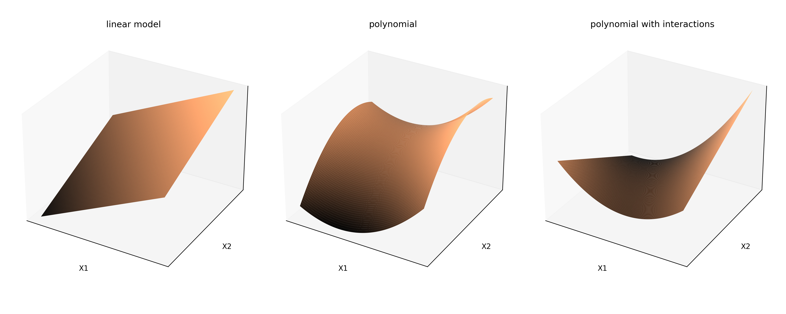
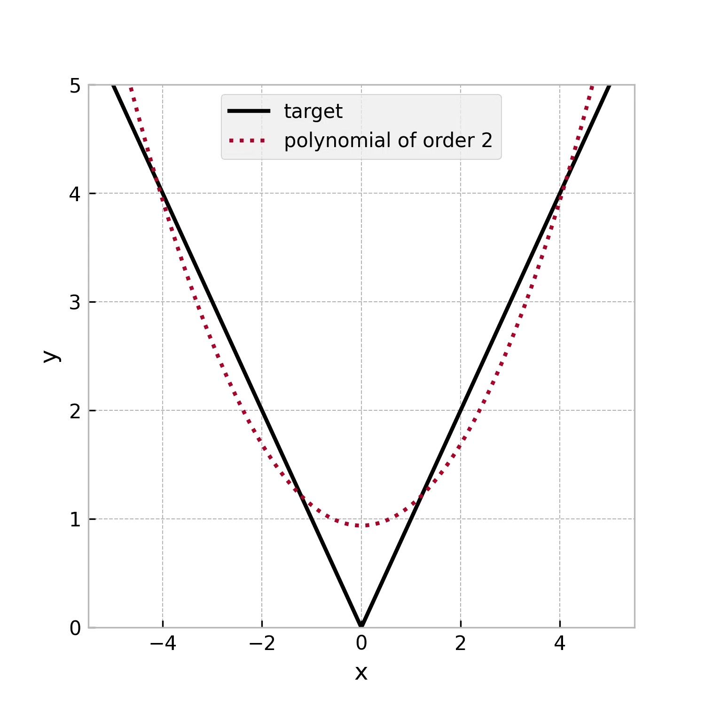
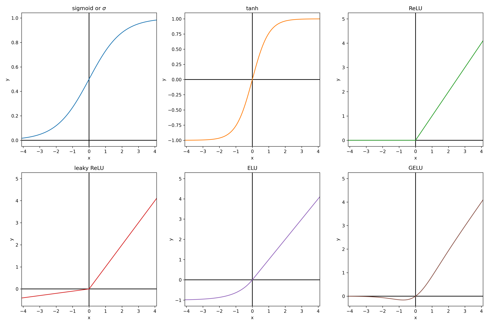

# Introduction to machine learning

Machine learning is often described as having an algorithm "learn" from "data".
More pragmatically it always consists in adjusting the parameters of a parametric model (for example the weights of a linear regression model) to maximize a numerical criterion representing the model's fitness for its task (for example, minimize the model's sum of squared errors for regression), using an optimization algorithm (gradient descent for example).
This is essentially the same definition as fitting a statistical model. The term "machine learning" emerged when the advance of computational powers allowed to move from very simple model for which the parameters maximizing the fitness criterion had an analytical solution, to more complex models which required stepwise optimization methods. Hence the learning part of machine learning, as "training" of the model could take a lot of time while the model was becoming increasingly better at it's task.

## Physics : a first example of parametric model

Physics is the science of describing the laws of our universe. It is the pioneer discipline that introduced the usage of mathematical parametric models: equations that take inputs, produce outputs, and depend on adjustable parameters.

Physics models remained mostly qualitative before Newton. For example, the trajectory of a canonball was approximated with simple geometrical shapes, and there existed Nomograms of the trajectory for several initial angles of the canon.

The first truely quantitative physical model was introduced with differential calculus by Isaac Newton (1643 - 1727):

$$
m \times \frac{\partial \vec{V}}{\partial t} = m \times \vec{g} + C \times \vec{V}^2
$$

This model is a parametric model that take as input the velocity, and gives the acceleration.
The parameters of the model are g the gravity acceleration constant, m the mass of the canonball, C the drag coefficient, and V0 the initial velocity at exit of the muzzle. The parameters of this physical model were determined independently by specially crafted experiments. For example, timing the fall of a marble of neglectible drag gives g. Weighting the canonball gives m. The drag coefficient C for a sphere of same diameter can be measured from the terminal velocity of a sphere made of a lighter material like paper. And finally, measuring the distance traveled by the canonball gives its initial velocity.

## Best fitting parameters

Measuring the value of each parameter independently with specialy crafted experiment is not always possible. Because sometimes parameters cannot be decoupled from each other, or new experiments cannot be freely done. Another alternative is to adjust all the parameters at once to best fit to the observations.

In the previous example, lets assume we have measurements of the trajectory of a canonball. We could adjust the parameters to obtain the best possible fit of the predicted trajectory with the experimentally measured trajectory.

This kind of approach was first publicated by Adrien-Marie Legendre in *Nouvelles méthodes pour la détermination des orbites des comètes* in 1805. He applied this method to find the equation of the conic best describing the trajectory of a comete. For his application, Legendre formalized the "best fit" as the set of parameters which minimizes the sum of square deviations between model and measurement points. The square in this criterion gives an higher weight to big errors, and takes the absolute value of the errors so that they can't compensate each others. This was coined as the least squares method.

For some specific cases, the sum of squared errors admits a single minimum and no maximum. Consequently the zero of its derivative with regards the parameters gives the best fiting set of parameters: the best fit is given by an analytical solution. Legendre notably gave an analytical solution of the optimum parameters (in the least squares sense) for linear model.

## Numerical optimization

Because it is not always possible analyticaly, optimization algorithms aim at finding numericaly the minimum of a function (often only a local minimum) in as few function evaluations as possible.

Under the heavy influence of numerical optimization in economics modeling, this function that we want to minimize is called the loss function or sometimes cost function.

### Gradient descent algorithm

The most commonly used optimization algorithm is the gradient descent algorithm, first publicated by Augustin-Louis Cauchy in *Compte Rendu à l'Académie des Sciences* in 1847. The loss as a function of other parameters can be seen as an hyper-surface we want to find the minimum of. The idea of the gradient descent is to start from an initial position of random parameters, and follow the slope of the cost function toward a local minimum.

The gradient is the vector of derivatives of the loss function with regards to each of the model's parameters. It points in the uphill direction, so we make small displacements in the parameters space, in the direction opposed to the gradient. In practice this displacement is usualy chosen as a factor called learning rate that multiplies minus the gradient. The gradient is function of the parameters and so must be updated at each step.

In this animation we fit a linear function y=a*x+b to some data points. In the left panel we represent the data points in blue, the fitted curve in green, and the deviation between observation and prediction in red. The loss to minimize is the sum of the squared lengths of the red segments.
On the right panel, we ploted values of the sum of squared error (the loss) as a function of the parameters a and b. The black dots are the positions in the parameters space. In this two-parameters case, the gradient descent can be viewed as following the slope of a 3D surface and can be visualized.

Idealy an analytical expression of the gradient should be used, otherwise the derivative of the loss $L$ with regards to each parameter $p_i$ can be approximated numerically as $\frac{\partial L}{\partial p_i} \approx \frac{L(p_i + \epsilon) - L(p_i - \epsilon)}{2 \epsilon}$ thanks to the definition of the derivative. However settings epsilon too high gives a bad approximation, and setting it too small gives numerical error during evaluation. Consequently the gradient descent might be less stable, and it is also more computationally intensive as there needs to be as many evaluation of this expression as there are parameters in the model to compute the full gradient.

The scale of the parameters is important for this algorithm. If the optimal parameters have different orders of magnitude, the learning rate might be too big for small parameters (oscilate around the optimum value) or too small for the big parameters (the parameters will take a prohibitively long number of steps to reach a satisfying value). In an atempt to give the same order of magnitude to the parameters, the inputs are often normalized to all have the same order of magnitude. Sometimes intermediate results are normalized as well, especially in deep learning. Some variations of the gradient descent, such as the Adam algorithm, try to mitigate this scaling issue by adaptatively scaling the gradient's vector components.

Additionaly it is to be noted that this algorithm might not find a solution close to the global minimum of the loss function as it might get stuck in a bassin: a local minimum. For this reason this algorithm might find a different solution depending on initialization of the parameters. There are variations of the gradient descent algorithm that aims at beeing robust to these local minimum, such as the bassin-hoping algorithm, or adding momentum. However in machine learning the canonicaly used models are well behaved numericaly and local minima usualy have performance nearly equal to the global minimum. For this reason the random initialization doesn't matter in practice.

### Genetic algorithm

Another less often used optimization algorithm is the genetic algorithm optimization (John Holland 1960). It is inspired for the theory of evolution. The vector of all the parameters of the model is assimilated to the genetic code of an individual. The criterion to optimize for is
a "fitness score" of the individual to its environment that we want to maximize.

We start with a random parameters vector. At each step we create "childs" copies of the previous state, with  the addition of random noise representing the mutations. Only the best fitted child is selected at the end. There exist a lot of variations, some more complex involving keeping the n best fit at each generation, or performing "matings" by mixing the parameter vectors of couples of individuals. Just like in gradient descent algorithm, the scale of the optimal parameters is important (because the amplitude of the random noise is usualy the same for all parameters). Input variables are usually normalized as well.

This algorithm is less often used than gradient descent because it usually requires more function evaluation to obtain the same results, due to the fact that displacements are random and not guided by a "slope". However it has the advantage of handling non-diferentiable cost functions and integer parameters natively.

## Universal approximators and overfiting

Thanks to numerical optimization we can fit any parametric model to observations. However finding an adequate mathematical model for each practical case would be an inefficient approach. Some universal approximators (parametric models that can approximate any function on a finite set of points by as close as wanted) are used instead. Usualy, the number of parameters of these models can be adjusted, and increasing the number of parameters increases the expressive power of these models.

Setting the number of parameters too low might hurt expresiveness of the model, and as such the model might underperform. Setting the number of parameters too high, in addition to hurt computation speed, might also give the model an excess of expressive power. Which might hurt generalization capability of the model because it learns noise of a sample and not a general trend in the data. This is called overfitting. The parameters that are chosen once and not changed during fitting, such as the number of parameters, are called hyper-parameters of the model.

In this animation, a polynomial of increasing order is fited to a set of training data. Another set of data called the test data is put aside an not used during training. The performance of the model can be evaluated on the test data, which is representative of the real performance of the model on unseen data. We can see that a more expressive model doesn't always mean a better model. Hyper-parameters are often adjusted manually until finding satisfactory results as it is often too costly to train a high number of models.

## Machine learning tasks for tabular data

We will fit each regression model on 1000 noisy observations from the function $y = exp((\frac{x1-0.5}{0.3})^2 + (\frac{x2-0.5}{0.3})^2) - exp((\frac{x1+0.5}{0.3})^2 + (\frac{x2+0.5}{0.3})^2)$

And each classification model will be fitted on random sample from two gaussian distributions:

## An overview of some commonly used models

In this section we will describe some commonly used machine learning models for application to tabular data.

### Linear and polynomial regression

Linear models are models of the form y = a1 \* x1 + ... + an \* xn + b.
This include polynomials of any order if we set xi = x^i. Sometimes interaction terms of the form xi\*xj are also added, as well as any custom numerical feature.
This kind of models have the advantage to have an analytical solution for the parameters that minimize the sum of squared errors to observations, which means training is orders of magnitude faster than other type of models. Linear models (polynomials of order one) also have the advantage to be simple enough that its parameters can be interpreted. Althought this is always dangerous with correlated inputs as the values of the optimum parameters can be extremly sensitive to noise. For example an increased weight can be compensated by a reduced weight from another highly correlated variable.

Polynomials are in theory universal approximators (see Lagrange polynomial interpolation). In practice they generalize poorly to new data, especially with high polynomial orders. And as illustrated below its expressive power scales poorly with polynomial order. Even for a simple 1D function such has the absolute value. For this reason this kind of models are usualy restricted to linear models or low order polynomials. They are used alone to describe low complexity functions, as piecewise linear function or piecewise polynomials for more complex functions (for example NASA polynomials fitted to describe thermodynamic parameters).

The fitting of our test function gives the following result:

### K nearest neighbours

The k nearest neighbours model was invented in 1951 by Joseph Hodges. It is an interpolation method from labeled observations rather than a parametric model. The Y value of a new observation is given by the average (sometime weighted by inverse distance) of the Y of the k closest labeled observations, with the integer k an hyperparameter of the model (usualy 3 or 5). It is an universal approximator by definition if the obsevations are weighted by inverse distance, because then it predicts without any error all the training observations.

This model has the advantage of beeing easy to interpret, as for a new observation it identifies similar points already labeled. It can be used for regression as well as classification and requires no training.
The evaluation on test data gives the following results:

### Decision tree

Decision tree are models that consist in successive binary splits of the training data using threshold criterion on input variables. The leafs of the obtained tree are associated to a constant prediction value, either a class for classification or a numerical value for regression. For classification, the class predicted at a leaf is the most frequent class amongst training data in this leaf. For regression, the numerical value predicted at a leaf is the average of the target values amongst training data in this leaf. If we make enough splits, there will be only one training observation in each leaf, which proves that this model is an universal approximator. To avoid reaching this state of overfitting, a maximum number of split can be chosen as an hyper-parameter. Sometimes there are additional stoping criteria such as the maximum depth of the tree, and the minimum number of sample in a leaf to allow the split.

During training the tree is expanded step by step by splitting one of the leafs in two at each step. There is a finite number of ways of spliting a set of observations in two groups with a threshold on an input variable (because we only consider thresholds at mid-distance between two distinct consecutive values of the variable). There is a finite number of input variables to split on. Consequently there is a finite number of ways of spliting a leaf of the tree. During training, all possible splits of all leafs are explored and scored. The next split chosen at each step is the split that scores best. This greedy algorithm doesn't ensure that the split are chosen optimaly for the final result, but exploring all possible trees would be prohibitively slow. For regression, the score chosen is usualy the reduction of mean squared error of the model (which simplifies to the difference between initial set variance and the average of variance of the two new sets). For classification, the score is usualy chosen as the reductions of the cross entropy of the model (which simplifies to the difference between cross entropy of the initial set and the sum of the cross entropy of the two new sets).

Decision tree have the advantage of needing no data normalization whatsoever, as they are not trained using an optimization method. The results of the model are easy to understand as the decision process for a prediction is a succession of conditions. They are also relatively robust to sparse data as even for regions with no close training observations, the evaluation of the model will remain in a reasonable range thanks to the constant prediction values. Another advantage of decision trees for regression is that the splits can be constrained for the model to be monotonously increasing or decreasing along specified input variables.

The training on the test data give the following results.

## Feed forward neural network

Feed forward neural networks (also called multi layer perceptron) are a type of neural network that can be used for regression or classification from tabular data, and is usualy trained with gradient descent. It is usualy represented in the following form:

The model is organised in layers. Each circle represents an intermediate numerical value, also called neuron. The blue circles are the input variables. The red circle are the hidden layers' neurons. The green circle is the predicted output. It is possible to have several outputs if several scalars should be predicted at once. For classification for example there is one output neuron per possible target class, and the prediction of the model is the class with the neuron most activated (highest numerical value). The calculations of the neurons' values are done from left to right (hence why it is sometimes called a feed forward neural network). Each neuron is connected to all the neurons of the previous layer by some synapses, indicating that each neuron depend exclusively on all the neurons of the previous layer (hence why it is sometimes called a fully connected neural network). The mathematical expression of a neuron is:

$$
X_{i,j} = f \left( b_{i,j} + \sum_k a_{i,k,j} \times X_{i-1,k} \right)
$$

This is essentially a linear function of the neurons of the previous layer, to which an activation function $f$ is applied. With $f$ chosen non linear, otherwise the whole neural network simplifies to a linear model. The activation function is usually the same for the whole network, excepted for the outputs, which usualy have no activation function unless we want to add some specific constraint to them. For example, in classification, the softmax function is applied to the outputs to convert the values between -inf and +inf to probabilities (between 0 and 1, such that the sum of the outputs is 1). The softmax function takes the exponential of each output (to have strictly positive values) and divide them all by the sum of the exponential of all outputs (so that they sum up to 1). Here below are some usual activation functions

ReLu is always a good default choice. And tanh and sigmoid are usualy avoided (except for output constraints) as there is only a small range of x for which the derivative of $f$ is not very close to zero. If for most training observations the inputs of $f$ is out of this range, variations of the parameters will have a very small effect on the variations of the neuron values. It hurts the proper training of the model with gradient descent. The affected neurons are "dead neurons" as their parameters nearly won't change. This is much less likely to happen with the other disymetrical activation functions that are linear on at least half of the input range.

Visualizing how a single neuron reacts to modifications of the parameters helps to understand the choice of its mathematical formulation. Let's consider a neuron with two inputs X1 and X2 that we will note $\vec{X}$. The mathematical expression of its output can be equivalently formulated as $y = f\left( (\vec{X} + \vec{b}) \cdot \vec{a}\right)$. If $f$ is the tanh function, the resulting function is a wave in the direction of $\vec{a}$. Modifying the amplitude of $\vec{a}$ changes the slope of the wave. Changing the bias $\vec{b}$ gives a position offset to the wave.

In this two inputs case it is intuitive how a linear combinations (with a bias) of such waves could approximate any 3D surface, hence any function with two inputs. In a more general manner the universal approximation theorem is a proof that feed forward networks with a single layer can approximates any function given enough neurons in the hidden layer. Experimentaly it is observed that using several hidden layers instead of a single one with many neurons can help the model to generalize a litle bit better.

The feed forward neural networks, like all neural networks, have the advantage of allowing the computation of the loss' gradient with the backpropagation method. The model consists in a composition of differentiable operations. The chain rule of derivatives gives us an expression of the derivative of a composition of functions. If all the intermediate results can be stored in memory, and an analytical solution of the jacobian matrix is known for all intermediate operations, then the gradient can be backpropagated from the loss to all the parameters. This computation time needed for the backpropagation is of the same order of magnitude as the forward pass of the loss evaluation. This makes the training of neural networks very scalable with parameters count.

The fitting of feed forward models on our test datasets gives the following results:

